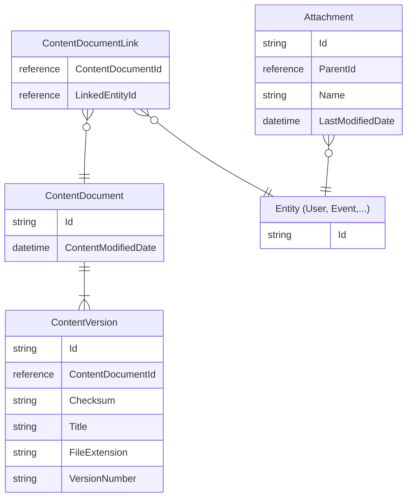

# Salesforce Archivist

This project aims to ease the process of archiving files uploaded to Salesforce. Storage in Salesforce can be
costly, and often there is no real need to keep old files inside Salesforce. Using this project allows
you to download files attached to objects in Salesforce and store them on disk. To be sure that the download process
was executed correctly, there is also a way to validate all downloaded files on disk against checksums from Salesforce.

## Motivation

I was recently tasked with cleaning old files and archiving those in GCS bucket. I did not work with Salesforce
before, so I started to search for existing tools. I found a few but only
[hardisgroupcom/sfdx-hardis](https://github.com/hardisgroupcom/sfdx-hardis) was free and could be used in CLI
inside a VM. `sfdx-hardis` has `hardis:org:files:export` command that is responsible for file export. It is a good tool
but has few shortcomings that can appear quite fast after using it with existing SF org. Here are some of those:
- **It is focused on object** - This approach is problematic when one object has thousands of files attached to it
  and something breaks or some files were not downloaded properly. Re-run skips download if object directory exists on
  disk. You need to remove whole directory to trigger download again.
- **Downloading big files sometimes breaks** - I encountered some issues when downloading big files (>1G) and was forced
  to manually download some files using `curl`.
- **No download validation** - There seems to be no way to validate if all files were downloaded and if checksums match.
- **It does not calculate API calls correctly** - Before actual download starts you are presented with statistics about
  how many calls will be issued. The problem is that those calculations do not take into account actual download calls.
  You can hit API limit pretty quickly and lock all other apps using same REST API.

## Features

- **Focused on files** - Based on configuration, it fetches a list of files to download and process it. In case of error
  re-run only downloads missing files. No problems when an SF object has thousands of files attached.
- **Reuse already downloaded files** - Because same files can be linked to multiple objects, it will reuse already
  downloaded file instead of downloading it again for new objects
- **Big files download** - using python `simple-salesforce` library can handle downloading big files pretty well.
- **Validation command** - When download is complete, you can run validation command to check disk files against
  checksums from Salesforce. No additional API calls made during validation process.
- **Mindful of Salesforce API limits** - Will pause download when configured API usage limit is hit and resume
  automatically when API usage drops.
- **Parallel downloads and validation** - Can download and validate in parallel using threads.

## Tech stack

Project is implemented in `Python 3.11` and is using [`uv`](https://github.com/astral-sh/uv) as package and project manager.
Main libraries used:
- [`simple-salesforce`](https://github.com/simple-salesforce/simple-salesforce) - handling Salesforce API
- [`click`](https://github.com/pallets/click) - working with CLI
- [`PyYaml`](https://github.com/yaml/pyyaml/) - config parsing
- [`schema`](https://github.com/keleshev/schema) - config validation
- [`pytest`](https://github.com/pytest-dev/pytest) - testing
- [`mypy`](https://github.com/python/mypy) - static type checks
- [`ruff`](https://github.com/astral-sh/ruff) - linting and code style
- [`poethepoet`](https://github.com/nat-n/poethepoet) - task automation

There are also some other smaller libraries used. You can check them inside `pyproject.toml`.

## Installation & Run

### Pre-made docker production image

> [!IMPORTANT]
> By default, all commands in production image are run by user with `UID=1000` and `GID=1000`.
> Be sure to set proper permissions to the mounted volumes before running archivist, otherwise it may not have
> permissions to configuration (`/archivist/config.yaml`) or data directory (`/archivist/data/`) inside container.

You can use pre-made docker production image like this:
```shell
docker run --interactive --tty \
  --volume /path/to/data/directory:/archivist/data \
  --volume /path/to/your.config.yaml:/archivist/config.yaml \
  ghcr.io/piotrekkr/salesforce-archivist:latest \
  --help
```

> [!TIP]
> Depending on the number of files and download size, operations can take a long time. You should probably use
> some terminal multiplexer like `tmux` or `screen` when running this tool on production VM.

### Plain Python

1. [Install `uv`](https://docs.astral.sh/uv/getting-started/installation/)
2. Clone project
   ```shell
   git clone git@github.com:piotrekkr/salesforce-archivist.git
   cd salesforce-archivist
   ```
3. Install packages
   ```shell
   uv sync
   ```
4. Copy an example configuration file and adjust to your needs
   ```shell
   cp config.example.yaml config.yaml
   #... edit config.yaml
   ```
5. Run archivist
   ```shell
   uv run archivist --help
   ```

## Authentication in Salesforce

Currently, this project can work with JWT authorization flow. You can follow
[this tutorial](https://developer.salesforce.com/docs/atlas.en-us.sfdx_dev.meta/sfdx_dev/sfdx_dev_auth_jwt_flow.htm)
to configure private key, self-signed certificate and a connected app.
Following the first and second step should be enough to make it work.

## Configuration

Example configuration file contains comments explaining the purpose of each configuration option. You can copy it and
adjust to your own needs.

```shell
cp config.example.yaml config.yaml
```

> [!IMPORTANT]
> Before you can use private key (server.key) in `config.yaml` you should encode it as `base64` string.

## Design

The relation between Salesforce objects (entities) and files looks like this:


Files (`ContentDocument` objects) can be linked (using `ContentDocumentLink` objects) to multiple entities
(SF objects like `User`, `Case`, and so on). File can have multiple versions (`ContentVersion` objects).

`Attachment` object is a legacy way of storing files in Salesforce. It is not recommended to use it anymore.
However, it is still used in some orgs. `Attachment` object is linked to other objects using `ParentId` field and
no versioning is available.

This project can handle both `ContentDocument` and `Attachment` objects.

### Download

Based on configuration, a download process will work as follows:

**ContentDocument objects:**

1. If exists, load already downloaded files list (`{data_dir}/downloaded_versions.csv)`).
2. For each object type defined in configuration:
   1. Load an existing content document link list (`{data_dir}/{obj_type}/document_links.csv`) or download from
      Salesforce with specified conditions.
   2. If exists, load content version list (`{data_dir}/{obj_type}/content_versions.csv`) or
      download it from Salesforce (based on the document link list).
   3. Based on those two lists, generate in memory mapping of files to download with objects they are linked to.
   4. For each file on the list above:
      1. Combine the file path (`{data_dir}/{obj_type}/files/{obj_id|custom_field}/{doc_id}_{version_num}_{id}_{title}.{ext}`)
      2. Check if the file is already on disk or was downloaded for some other object, and if needed, copy the file to new
         location and update the downloaded files list.
      3. If above is not the case, then fetch the file from Salesforce and update the downloaded files list.
      4. Check API limits, and if needed, wait for usage to drop below the threshold.
   5. Save downloaded files list on disk.

**Attachment objects:**

1. If exists, load already downloaded attachment list (`{data_dir}/attachments.csv)`).
2. Load existing attachments list or download from Salesforce with specified conditions
3. For each file on the list above:
   1. Combine the file path (`{data_dir}/Attachment/files/{parent_id}/{filename}`).
   2. If the file exists on the disk, then update the downloaded attachment list.
   3. If the above is not the case, then fetch attachment from Salesforce and update downloaded attachment list.
   4. Check API limits, and if needed, wait for usage to drop below the threshold.
4. Save downloaded attachment list on disk.

When the download process is complete, show statistics.

### Validation

**ContentDocument objects:**

1. If exists, load already validated files list (`{data_dir}/validated_versions.csv)`).
2. For each object type defined in configuration:
   1. Load the existing content document link list (`{data_dir}/{obj_type}/document_links.csv`) or download from
      Salesforce with specified conditions.
   2. If exists, load content version list (`{data_dir}/{obj_type}/content_versions.csv`) or download it
      from Salesforce (based on the document link list).
   3. Based on those two lists, generate in memory mapping of files to download with objects they are linked to.
   4. For each file on the list above:
      1. If the file does not exist on disk, or was already validated and checksum does not match with Salesforce,
         then mark the file as invalid.
      2. If the file was not validated before, calculate checksum of the disk file, update the validated list, compare
         checksum and if necessary, mark the file as invalid.
   5. Save validated files list on disk.

**Attachment objects:**

1. If exists, load already validated files list (`{data_dir}/validated_versions.csv)`).
2. Load attachment files list to validate.
3. For each file on the list above:
   1. If the file does not exist on disk, or was already validated and filesize does not match with Salesforce,
      then mark the file as invalid.
   2. If the file was not validated before, calculate file size, update validated list, compare
      size with Salesforce size, and if needed, mark file as invalid.
4. Save validated files list on disk.

When validation is complete, show statistics.

## HOWTOs

### Download and validate with one command

```shell
docker run --interactive --tty \
  --volume /path/to/data/directory:/archivist/data \
  --volume /path/to/your.config.yaml:/archivist/config.yaml \
  ghcr.io/piotrekkr/salesforce-archivist:latest \
  download --validate
```

### Re-download content version list and document link list

You can remove CSV files from disk, and the next download will fetch full lists again from Salesforce.
```shell
# for chosen type
rm -rf {data_dir}/{object_type}/*.csv

# or for all types
rm -rf {data_dir}/*/*.csv
```

### How to force re-validate all files again?

Already calculated checksums for downloaded files are kept in `{data_dir}/validated_versions.csv`.
You can remove this file or selected lines from inside this file. This will trigger full validation again.

### How to remove invalid files and redownload them

Validation can show that some checksum or size of downloaded files do not match with values from Salesforce.
To remove them and download again, you can use `--remove-invalid` flag. This flag will remove invalid files from
the validated files list and from disk.

```shell
# download validate and remove invalid in one command
docker run --interactive --tty \
  --volume /path/to/data/directory:/archivist/data \
  --volume /path/to/your.config.yaml:/archivist/config.yaml \
  ghcr.io/piotrekkr/salesforce-archivist:latest \
  download --validate --remove-invalid

# remove after validation
docker run --interactive --tty \
  --volume /path/to/data/directory:/archivist/data \
  --volume /path/to/your.config.yaml:/archivist/config.yaml \
  ghcr.io/piotrekkr/salesforce-archivist:latest \
  validate --remove-invalid
```

## Contributing

// TODO

## TODO

- Add cli options to force re-download versions and document link lists
- Add some example terraform and/or ansible to use for deploy to VM in the cloud
- Use proper logging
